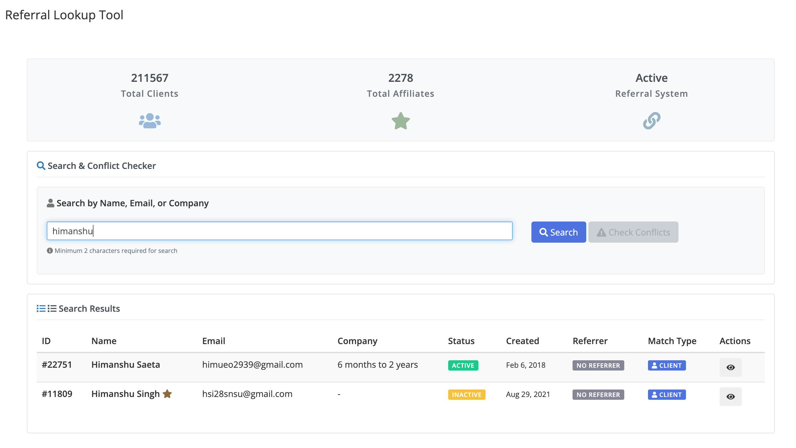
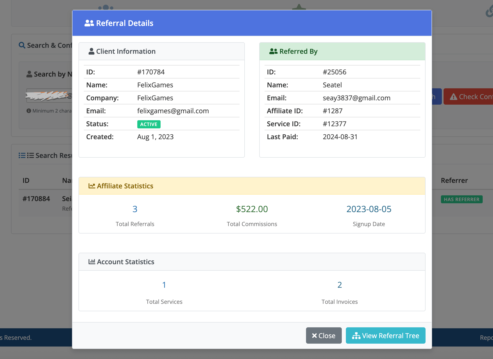
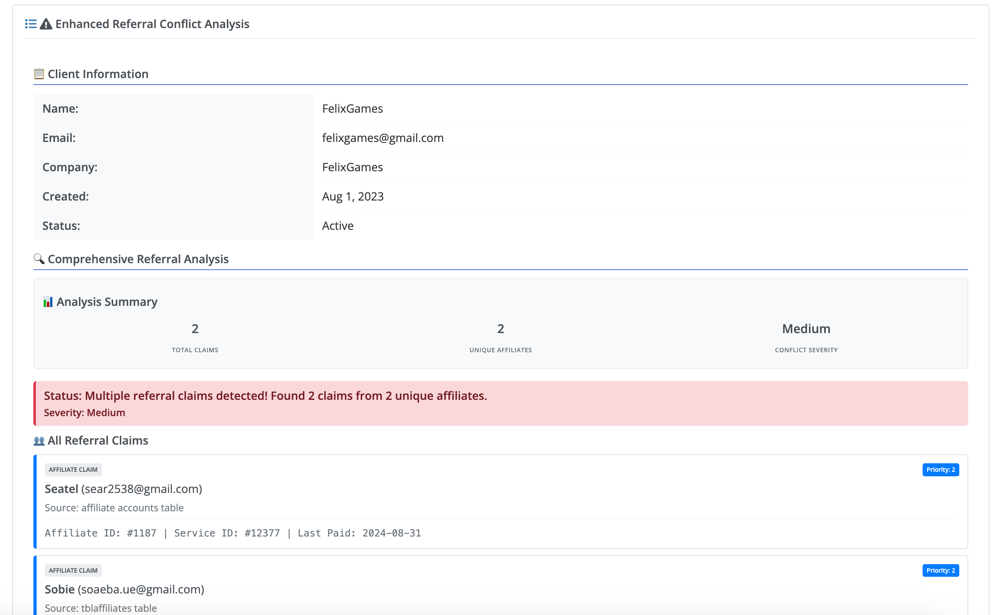
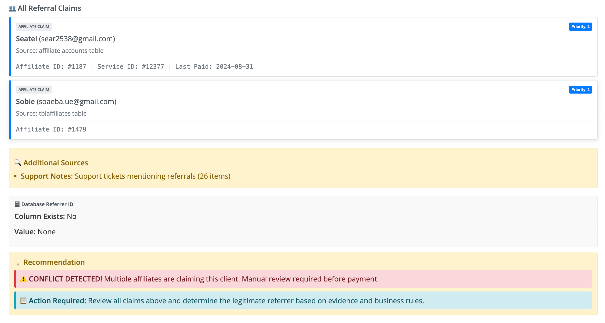

# 🔍 WHMCS Referral Lookup Tool

[](https://www.whmcs.com)
[](https://php.net)
[](LICENSE)
[](https://cyberin.in)

> A powerful and professional admin tool for WHMCS to search, analyze, and manage customer referral relationships with comprehensive conflict detection and affiliate tracking.

---

## 🎯 Why This Addon is Essential

### 💰 **Prevent Revenue Loss**

- **Multiple Affiliate Claims**: Detect when multiple affiliates claim the same client
- **Duplicate Commission Payments**: Avoid paying commissions to multiple affiliates for the same referral
- **Revenue Protection**: Ensure accurate affiliate commission distribution

### 🔍 **Resolve Referral Disputes**

- **Conflict Detection**: Automatically identify conflicting referral claims
- **Evidence-Based Resolution**: Provide detailed evidence for each claim
- **Fair Commission Distribution**: Make informed decisions based on comprehensive data

### 📊 **Business Intelligence**

- **Referral Analytics**: Understand your referral program performance
- **Affiliate Performance**: Track which affiliates are most effective
- **Client Journey Analysis**: See how clients discover your services

### ⚡ **Operational Efficiency**

- **Quick Client Lookup**: Find client referral information instantly
- **Automated Conflict Detection**: Save hours of manual investigation
- **Professional Interface**: Clean, intuitive admin interface

---

## 🚀 Key Features

### ✨ **Advanced Conflict Detection**

- **Multi-Source Analysis**: Checks all WHMCS affiliate tables
- **Priority-Based Claims**: Database referrers vs affiliate claims
- **Severity Assessment**: High/Medium/None conflict levels
- **Detailed Evidence**: Complete claim history and sources

### 🔍 **Comprehensive Search**

- **Client Search**: By name, email, company, or domain
- **Real-time Results**: Instant search with auto-complete
- **Smart Matching**: Intelligent search algorithms
- **Detailed Profiles**: Complete client and referral information

### 📊 **Enhanced Analytics**

- **Referral Trees**: Multi-level referral relationship visualization
- **Affiliate Statistics**: Performance metrics and commission history
- **Conflict Analysis**: Detailed breakdown of all claims
- **Audit Trail**: Complete activity logging

### 🛡️ **Professional Features**

- **Admin-Only Access**: Secure, role-based permissions
- **Bootstrap 4 Compatible**: Works seamlessly with WHMCS admin
- **Performance Optimized**: Zero impact on WHMCS performance
- **Mobile Responsive**: Works on all devices

---

## 📸 Screenshots

### 🏠 **Main Dashboard**


_Clean, professional interface with search functionality and statistics overview_

### 🔍 **Client Search & Results**


_Comprehensive client information with referral analysis and affiliate details_

### ⚠️ **Enhanced Conflict Detection**


_Advanced conflict detection showing multiple affiliate claims with severity assessment_

### 👥 **All Referral Claims**


_Detailed breakdown of all referral claims with priority levels and affiliate information_

---

## 🛡️ Performance & Reliability

### **Zero Performance Impact**

- **Conditional Loading**: Only loads when needed (not during cron/API/CLI)
- **Memory Management**: Monitors memory usage and prevents overload
- **Database Optimization**: Efficient queries with proper indexing
- **Caching**: Static content caching to reduce file system access

### **Context-Aware Execution**

- **Cron Job Safe**: Automatically disabled during WHMCS cron executions
- **API Compatible**: Only loads for addon-specific operations
- **CLI Friendly**: Disabled during command-line operations
- **Admin Context**: Only runs in admin area for authenticated users

### **Resource Protection**

- **Memory Thresholds**: Disables features if memory usage exceeds 80%
- **Query Limits**: Monitors database query count to prevent overload
- **Load Time Protection**: Skips non-essential features if page load exceeds 5 seconds
- **Progressive Enhancement**: Core functionality works even if styling fails

---

## 📋 Requirements

- **WHMCS**: Version 8.0 or higher
- **PHP**: Version 7.4 or higher
- **MySQL**: Version 5.7 or higher
- **Browser**: Modern web browser with JavaScript enabled

---

## 🛠️ Installation

### Method 1: Direct Upload

1. Download the latest release
2. Extract the `referral_lookup` folder
3. Upload to your WHMCS `modules/addons/` directory
4. Go to **WHMCS Admin → Setup → Addon Modules**
5. Find "Referral Lookup Tool" and click **Activate**
6. Configure settings as needed

### Method 2: Git Clone

```bash
cd modules/addons/
git clone https://github.com/himstar/whmcs-referral-lookup-tool.git referral_lookup
```

---

## ⚙️ Configuration

### Basic Settings

1. Navigate to **Addon Modules → Referral Lookup Tool**
2. Configure settings:
   - **Enable Detailed Logging**: Track all lookup activities (disabled by default for performance)
   - **Results Per Page**: Number of search results to display (10-100)
   - **Auto-refresh**: Enable automatic data refresh

### Database Integration

The addon automatically integrates with existing WHMCS tables:

- `tblclients` - Client information and relationships
- `tblaffiliates` - Affiliate account data
- `tblaffiliatesaccounts` - Referral tracking and commissions
- `tblhosting` - Service relationships
- `mod_referral_lookup_logs` - Activity audit trail (created on activation)

---

## 🎯 Usage Guide

### 🔍 **Basic Client Search**

1. Navigate to **Addon Modules → Referral Lookup Tool**
2. Enter search term (minimum 2 characters)
3. View results with client information and referral status
4. Click "View Details" for comprehensive information


_Start your search from the main dashboard interface_

### ⚠️ **Conflict Detection**

1. Enter a valid email address in the search field
2. Click "Check Conflicts" button
3. Review detailed analysis showing:
   - **Total Claims**: Number of referral records found
   - **Unique Affiliates**: Number of different affiliates claiming
   - **Conflict Severity**: High/Medium/None based on claim count
   - **All Referrers**: Complete list with detailed information
   - **Additional Sources**: Custom fields and support notes


_Advanced conflict detection with comprehensive analysis and severity assessment_

### 📊 **Referral Analysis**

1. Search for any client
2. Click "View Details" to see comprehensive referral information
3. View affiliate statistics and performance metrics
4. Use "View Referral Tree" for multi-level relationship analysis


_Detailed client information with complete referral analysis_

---

## 🏗️ Technical Architecture

### **File Structure**

```
referral_lookup/
├── referral_lookup.php      # Main addon entry point & configuration
├── functions.php            # Core business logic & database operations
├── hooks.php               # WHMCS hooks for admin area enhancement
├── performance.php         # Performance monitoring & optimization
├── install.php             # Installation helper & verification
├── assets/
│   ├── referral-lookup.css # Main styling (Bootstrap 4 compatible)
│   ├── referral-lookup.js  # Frontend functionality
│   ├── admin-styles.css    # WHMCS admin area styling
│   └── style.css          # Additional custom styles
├── lang/
│   └── english.php         # Language strings
├── debug_affiliate.php     # Debug tool for affiliate claims
├── test_conflict.php       # Test tool for conflict detection
└── README.md              # This comprehensive documentation
```

### **Database Integration**

The addon performs comprehensive analysis across multiple WHMCS tables:

#### **Primary Tables**

- **`tblclients`**: Client information and `referrer_id` relationships
- **`tblaffiliates`**: Affiliate account records
- **`tblaffiliatesaccounts`**: Service-based affiliate claims
- **`tblhosting`**: Client service relationships

#### **Additional Tables**

- **`tblaffiliates_referrers`**: Referrer relationship tracking
- **`tblaffiliateshistory`**: Historical affiliate data
- **`tblcustomfields`**: Custom field referral information
- **`tblticketreplies`**: Support notes mentioning referrals

### **API Endpoints**

- `search_clients`: Search for clients with referral information
- `get_referral_details`: Get detailed client referral analysis
- `check_referral_conflicts`: Comprehensive conflict detection
- `get_referral_tree`: Multi-level referral relationship tree

---

## 🔧 Troubleshooting

### **Common Issues & Solutions**

#### **Search Not Working**

- Check browser console for JavaScript errors
- Verify WHMCS admin permissions
- Ensure database connectivity
- Clear browser cache

#### **No Referral Data Found**

- Verify affiliate system is enabled in WHMCS
- Check database table structure
- Review referral tracking configuration
- Use debug tools to verify data exists

#### **Performance Issues**

- Disable detailed logging if not needed
- Check memory usage in WHMCS admin
- Monitor database query performance
- Review server resources

### **Debug Tools**

The addon includes built-in debug tools:

#### **Debug Affiliate Claims**

Access `modules/addons/referral_lookup/debug_affiliate.php` to:

- Check all affiliate tables for a specific client
- Verify data relationships
- Identify missing or corrupted data
- Trace affiliate claim chains

#### **Test Conflict Detection**

Access `modules/addons/referral_lookup/test_conflict.php` to:

- Test the enhanced conflict detection logic
- View detailed analysis results
- Verify data processing accuracy
- Debug specific email addresses

### **Performance Monitoring**

- **Memory Usage**: Tracks memory consumption in real-time
- **Load Times**: Monitors page load duration
- **Database Queries**: Counts and limits database operations
- **Operation Logging**: Logs performance metrics when detailed logging is enabled

---

## 🎨 Customization

### **Styling Customization**

The addon uses Bootstrap 4 and can be customized by modifying:

- `assets/referral-lookup.css` - Main styles and responsive design
- `assets/admin-styles.css` - WHMCS admin area styling
- `assets/style.css` - Additional custom styles

### **Language Support**

Add new languages by creating files in the `lang/` directory:

1. Copy `english.php` to `your-language.php`
2. Translate the language strings
3. Update the addon configuration

### **Functionality Extension**

Extend functionality by modifying:

- `functions.php` - Core business logic and database operations
- `assets/referral-lookup.js` - Frontend behavior and interactions
- `hooks.php` - WHMCS admin area enhancements

---

## 🤝 Contributing

We welcome contributions! Please follow these steps:

1. **Fork** the repository
2. **Create** a feature branch (`git checkout -b feature/amazing-feature`)
3. **Commit** your changes (`git commit -m 'Add amazing feature'`)
4. **Push** to the branch (`git push origin feature/amazing-feature`)
5. **Open** a Pull Request

### **Development Setup**

```bash
# Clone the repository
git clone https://github.com/himstar/whmcs-referral-lookup-tool.git

# Install dependencies (if any)
composer install

# Set up development environment
cp config.example.php config.php
# Edit config.php with your settings
```

### **Code Standards**

- Follow PSR-12 coding standards
- Add proper documentation
- Include unit tests for new features
- Update README for new functionality

---

## 📄 License

This project is licensed under the MIT License - see the [LICENSE](LICENSE) file for details.

### **License Summary**

- ✅ **Commercial Use**: Allowed
- ✅ **Modification**: Allowed
- ✅ **Distribution**: Allowed
- ✅ **Private Use**: Allowed
- ⚠️ **Liability**: Limited
- ⚠️ **Warranty**: Limited

---

## 🏢 About Cyberin

**Cyberin** is a leading web hosting and technology solutions provider, specializing in:

- 🌐 **Web Hosting Solutions**: Shared, VPS, Dedicated hosting
- 🛡️ **Security Services**: SSL certificates, DDoS protection
- ☁️ **Cloud Solutions**: Cloud hosting and infrastructure
- 🛠️ **Custom Development**: WHMCS modules and custom solutions

### **Connect With Us**

- 🌐 **Website**: [https://cyberin.in](https://cyberin.in)
- 📧 **Email**: info@cyberin.in

---

## 📈 Changelog

### **Version 1.2.0 (Current)**

- ✨ **Enhanced Conflict Detection**: Multi-source analysis with priority-based claims
- 🎯 **Improved UI**: Clean, professional Bootstrap 4 compatible design
- 📊 **Comprehensive Analytics**: Detailed referral analysis and statistics
- 🛡️ **Performance Optimization**: Zero impact on WHMCS performance
- 🔧 **Better Error Handling**: Robust error handling and validation
- 📱 **Mobile Responsive**: Works perfectly on all devices

### **Version 1.1.0**

- 🛠️ **Database Compatibility**: Fixed compatibility issues with various WHMCS setups
- ⚡ **Performance Improvements**: Optimized search and query performance
- 🎨 **Visual Enhancements**: Better design and user experience
- 📝 **Documentation**: Enhanced documentation and usage guides

### **Version 1.0.0**

- 🚀 **Initial Release**: Basic search functionality and referral tracking
- 🔍 **Client Search**: Search by name, email, company, or domain
- 📊 **Referral Tracking**: Basic referral relationship detection
- ⚠️ **Conflict Detection**: Initial conflict detection capabilities

---

## 📞 Support

### **Getting Help**

- 📖 **Documentation**: Check this README first for comprehensive guidance
- 🐛 **Issues**: Report bugs on GitHub Issues
- 💬 **Discussions**: Join GitHub Discussions for community support
- 📧 **Email**: Contact us at support@cyberin.in

---

<div align="center">

**Made with ❤️ by [Cyberin](https://cyberin.in)**


_Empowering businesses with reliable hosting solutions_

</div>
